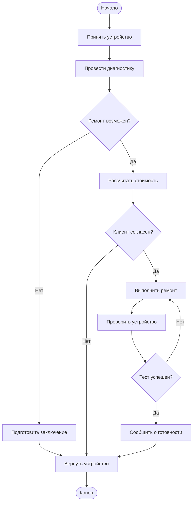

# Flowchart

```mermaid
flowchart TD
    A([Начало]) --> B[Принять устройство]
    B --> C[Провести диагностику]
    C --> D{Ремонт возможен?}
    D -- Нет --> E[Подготовить заключение]
    E --> J[Вернуть устройство]
    D -- Да --> F[Рассчитать стоимость]
    F --> G{Клиент согласен?}
    G -- Нет --> J
    G -- Да --> H[Выполнить ремонт]
    H --> I[Проверить устройство]
    I --> M{Тест успешен?}
    M -- Нет --> H
    M -- Да --> K[Сообщить о готовности]
    K --> J
    J --> L([Конец])
```
