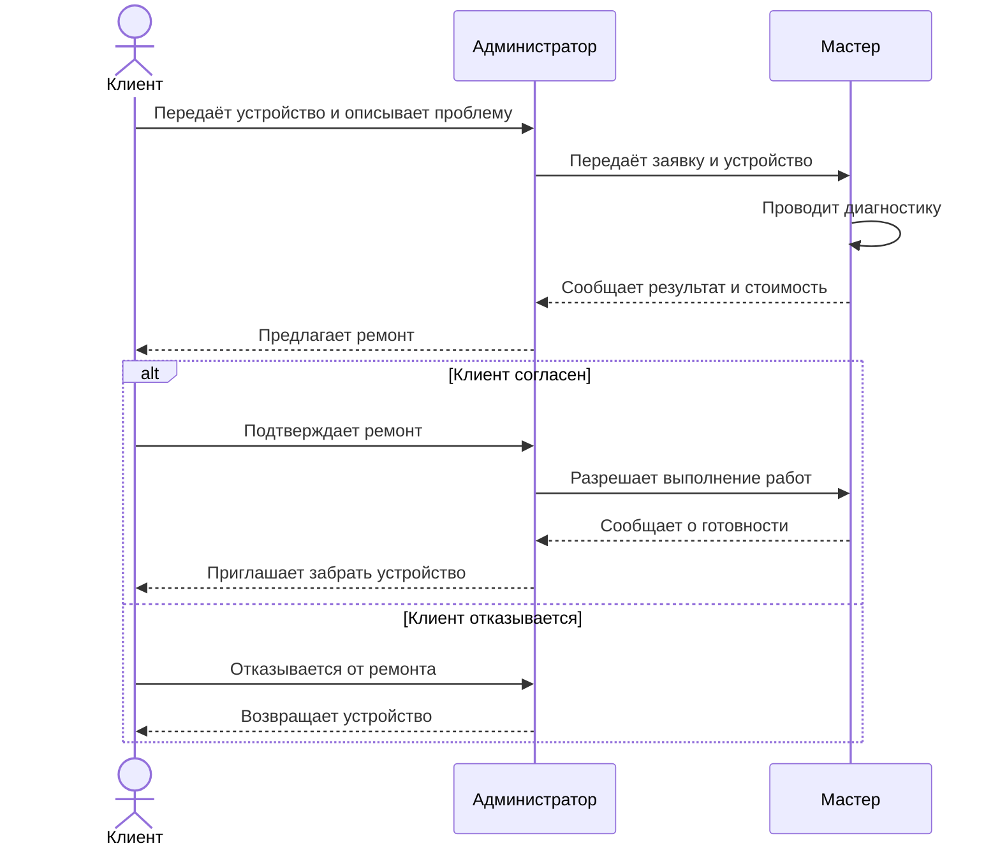

# Sequence Diagram

```mermaid
sequenceDiagram
    actor C as Клиент
    participant A as Администратор
    participant T as Мастер

    C->>A: Передаёт устройство и описывает проблему
    A->>T: Передаёт заявку и устройство
    T->>T: Проводит диагностику
    T-->>A: Сообщает результат и стоимость
    A-->>C: Предлагает ремонт
    alt Клиент согласен
        C->>A: Подтверждает ремонт
        A->>T: Разрешает выполнение работ
        T-->>A: Сообщает о готовности
        A-->>C: Приглашает забрать устройство
    else Клиент отказывается
        C->>A: Отказывается от ремонта
        A-->>C: Возвращает устройство
    end
```
