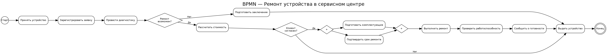
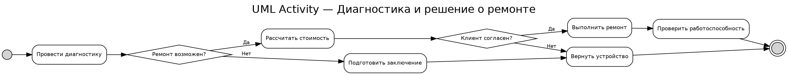
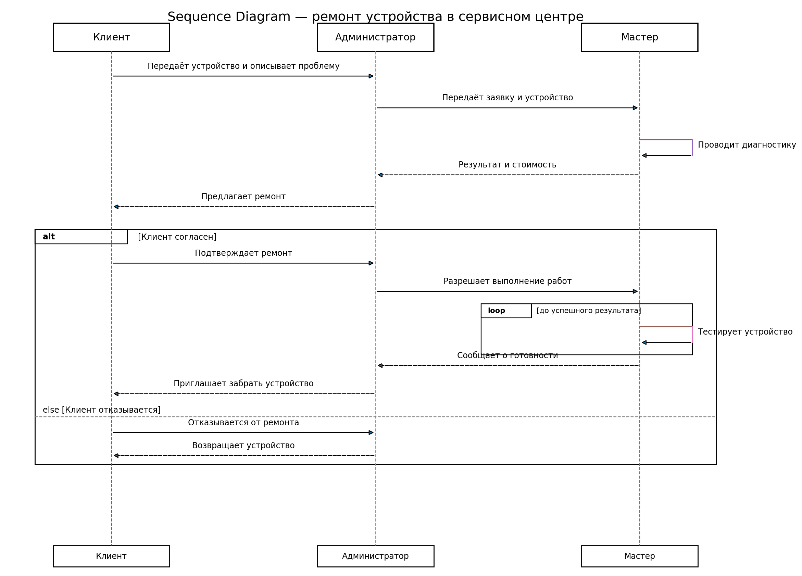
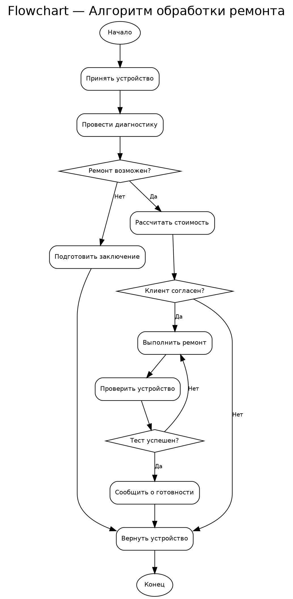

# Отчёт по лабораторной работе №1

## Тема
Моделирование процессов с использованием Git и визуальных нотаций.

## Краткое описание процесса
В работе смоделирован процесс ремонта устройства в сервисном центре. В нём участвуют клиент, администратор и мастер. Процесс включает приём устройства, регистрацию заявки, диагностику, согласование стоимости, выполнение ремонта, проверку результата и выдачу устройства. Предусмотрены альтернативные ветви при невозможности ремонта и при отказе клиента, а также параллельная подготовка комплектующих и подтверждение срока ремонта.

## Диаграммы

### 1. BPMN

Исходник: [`diagrams/process.bpmn`](diagrams/process.bpmn)

### 2. UML Activity Diagram

Исходник: [`diagrams/activity.drawio`](diagrams/activity.drawio)

### 3. Sequence Diagram

Исходник Mermaid: [`docs/sequence.md`](docs/sequence.md)

### 4. Flowchart

Исходник Mermaid: [`docs/flowchart.md`](docs/flowchart.md)

## Демонстрация Git diff
При изменении файла `process.bpmn` Git показывает конкретные строки XML, которые были добавлены или изменены. Для PNG-файла содержимое построчно сравнить нельзя: Git фиксирует изменение бинарного файла. Аналогичное сравнение выполнено для UML и Mermaid-файлов.

- [`docs/diff-bpmn.txt`](docs/diff-bpmn.txt)
- [`docs/diff-uml-mermaid.txt`](docs/diff-uml-mermaid.txt)

## Выводы
> **Важно:** преподаватель требует написать вывод самостоятельно. Перед сдачей замените текст ниже на 2–3 своих предложения.

В ходе работы я настроил структуру Git-репозитория и закрепил основные операции с коммитами. Я увидел, что текстовые форматы BPMN, draw.io и Mermaid удобны для контроля изменений, потому что Git может показать различия в содержимом. Для PNG видно только то, что бинарный файл изменился, поэтому исходные текстовые форматы удобнее для совместной работы и версионирования.
